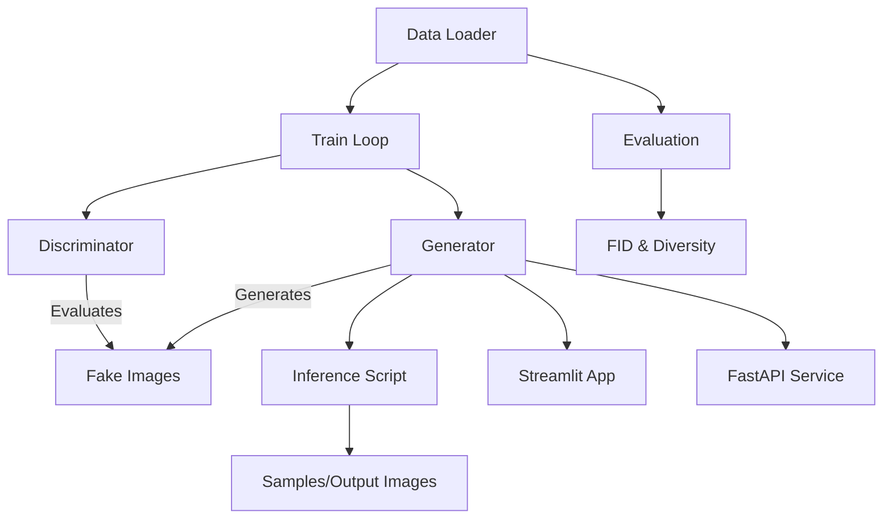

# Synthetic Image Generator (Vanilla GAN)

A compact, easy-to-run implementation of a Vanilla GAN that generates 28×28 grayscale images (MNIST-style). This repository contains everything needed to train, evaluate, serve and monitor a small experimental GAN for research, demos, and data augmentation.

---

## 📌 Project Introduction

This project demonstrates a Vanilla Generative Adversarial Network (GAN) end-to-end: from data preparation and model training to evaluation and serving. It is designed to be simple, reproducible, and suitable for small-scale experiments or educational use.

Why this project matters:
- Create privacy-preserving synthetic images for augmentation or sharing
- Demonstrate core GAN concepts in a compact codebase
- Provide a reproducible pipeline for experimentation and evaluation
- Prevents exposure of real or sensitive data by generating statistically similar but synthetic samples

---

## 🧭 Overview

- Data: MNIST-style grayscale images (28×28)
- Model: Vanilla GAN (fully connected generator with optional reshaping and a convolutional discriminator)
- Delivery: CLI scripts, Streamlit demo UI (`src/app.py`) and FastAPI service (`src/api.py`)
- Metrics: FID, diversity and t-SNE visualizations via `src/evaluation.py`

---

## 📁 File structure

```text
Synthetic-Digits-Generator-VanillaGAN/
├── config.yaml                 # default hyperparameters
├── requirements.txt
├── Dockerfile                  # (optional) containerization
├── checkpoints/                # periodic checkpoints
├── outputs/                    # final model artifacts
├── samples/                    # generated images
├── figures/                    # evaluation plots
├── logs/                       # training logs (CSV & TensorBoard)
└── src/
    ├── train.py
    ├── inference.py
    ├── evaluation.py
    ├── app.py                  # Streamlit demo
    ├── api.py                  # FastAPI server
    ├── vanilla_gan.py
    ├── generator.py
    ├── discriminator.py
    ├── data_loader.py
    └── utils/
        ├── visualizer.py
        └── logger.py
```
Note: Some directories such as `checkpoints/`, `logs/`, and `data/` were excluded from version control in `.gitignore` to keep the repository lightweight.

---

## Architecture Flow

Below is a high-level diagram showing the core process from data loading, through training, to inference and deployment.



---

## 🧩 Modules & Design

### 1) Data Pipeline & Preprocessing

- Uses `torchvision.datasets.MNIST` in `src/data_loader.py`
- Transforms: resize, ToTensor, Normalize to (-1, 1)
- Splits dataset into train/test and saves processed subsets under `data/processed/`
- `get_dataloaders()` reads `config.yaml`, constructs transforms, downloads MNIST to `data/raw`, performs `random_split`, and returns `DataLoader` objects.

Commands:
```bash
python -c "from src.data_loader import get_dataloaders; get_dataloaders()"
```

---

### 2) Model Design (Vanilla GAN Architecture)

- Generator: Transforms noise vector z (dim = `noise_dim`) into 28×28 image using Linear → ReLU → ConvTranspose layers and `Tanh` output.
- Discriminator: Small convolutional network ending with Sigmoid probability output.

Architecture:

Generator (z → image):
```
[z (100)]
  └─ Linear(100 → 128*7*7)
      └─ ReLU
          └─ Unflatten → (128,7,7)
              └─ ConvTranspose2d(128→64, k=4, s=2, p=1)
                  └─ ReLU
                      └─ ConvTranspose2d(64→1, k=4, s=2, p=1)
                          └─ Tanh -> (1,28,28)
```

Discriminator (image → prob):
```
(1,28,28)
  └─ Conv2d(1→64, k=4, s=2, p=1)
      └─ LeakyReLU
          └─ Conv2d(64→128, k=4, s=2, p=1)
              └─ LeakyReLU
                  └─ Flatten → Linear(128*7*7 → 1) → Sigmoid
```

Low-level details (weights, activations, loss):
- Loss: `BCELoss` for both D and G as implemented in `src/vanilla_gan.py`
- Optimizer: Adam with `lr` and `beta1` from `config.yaml`
- Label smoothing for real images (0.9 used in `src/train.py`)

---

### 3) Training Pipeline

1. Load config from `config.yaml`
2. Build dataloaders and models (G, D)
3. For each epoch: update D on real and fake, update G to fool D
4. Log losses to TensorBoard, save checkpoints to `checkpoints/`

Key files: `src/train.py`, `src/vanilla_gan.py`, `src/utils/logger.py`, `src/utils/visualizer.py`

Commands:
```bash
python src/train.py
# monitor progress
tensorboard --logdir=runs
```

Best practices:
- Use a GPU when available: torch auto-detects CUDA
- Use small batches or limit data if memory is constrained
- Check checkpoints under `checkpoints/` to resume training

---

### 4) Evaluation & Quality Assurance

- `python src/evaluation.py` computes FID and diversity and saves a t-SNE plot to `figures/`
- Tests to add: unit tests for `data_loader`, shape checks for model outputs, smoke tests for inference and API endpoints
- Recommended CI checks: linting (`flake8`/`ruff`), unit tests, and a small smoke test that loads model weights and runs `src/inference.py` with `num_images=4`

---

### 5) Deployment Layer

Options included in repo:
- Streamlit demo (`src/app.py`) — run locally with `streamlit run src/app.py`
- FastAPI microservice (`src/api.py`) — run with `uvicorn src.api:app --reload`
- Docker: There is a `Dockerfile` (update if you want a production image)

Production suggestions:
- Containerize model + app, serve behind an ASGI server (Gunicorn + Uvicorn workers)
- Use model versioning for A/B testing and rollback

---

### 6) Monitoring & Update Pipeline

- Training metrics: TensorBoard logs in `runs/` and CSV logs in `logs/training_logs.csv`
- Model artifacts: store in `outputs/` and tag with epoch/version
- Suggested automations:
  - CI job to run tests and/or a lightweight evaluation on new PRs
  - Scheduled retraining jobs (cron / GitHub Actions) for frequent data drift checks
  - Alerts for metric regressions (e.g., FID increase)

---

## ⚙️ Configuration (fields in `config.yaml`)

- `image_size` (int): image height and width (default 28)
- `channels` (int): image channels (1)
- `noise_dim` (int): size of latent vector (100)
- `batch_size` (int): training batch size
- `epochs` (int)
- `lr` (float): learning rate
- `beta1` (float): Adam optimizer beta1
- `train_split` (float): train / test split ratio
- `normalization` (string): normalization applied to images (tanh)

---

## ▶️ Execution Commands
### Core Commands (Executed During Development)
Setup and install:
```bash
python -m venv .venv
source .venv/bin/activate     #for macos/linux
.venv\Scripts\activate        #for windows(cmd)
pip install -r requirements.txt
```

Load and preprocess dataset:
```bash
python -c "from src.data_loader import get_dataloaders; get_dataloaders()"
```

Train:
```bash
python src/train.py
```

Evaluate:
```bash
python src/evaluation.py
```

Run demo locally:
```bash
streamlit run src/app.py
```

Run API server:
```bash
uvicorn src.api:app --reload
```

### Optional / Extended Commands
Inference (save grid):
```bash
python src/inference.py --model-path outputs/G_final.pt --num-images 16
```

Run quick smoke test:
```bash
python -c "from src.inference import generate_images; generate_images(num_images=4)"
```

---

## ⚠️ Limitations

- Uses a basic Vanilla GAN architecture (no DCGAN or WGAN-GP).
- Image quality is limited compared to modern diffusion models.

These limitations are intentional to maintain simplicity and educational clarity.

---

## 👥 Team

<table>
  <tr>
      <td align="center">
      <a href="https://github.com/ishitachowdary">
        
        <br />
        <sub><b>Ishitha Chowdary</b></sub>
      </a>
      <br />
    </td>
    <td align="center">
      <a href="https://github.com/LaxmiVarshithaCH">
        
        <br />
        <sub><b>Chennupalli Laxmi Varshitha</b></sub>
      </a>
      <br />
    </td>
    <td align="center">
      <a href="https://github.com/LaxmiVarshithaCH">
        
        <br />
        <sub><b>Y. Jhansi</b></sub>
      </a>
      <br />
    </td>
      <td align="center">
      <a href="https://github.com/LaxmiVarshithaCH">
        
        <br />
        <sub><b>V. Swarna Blessy</b></sub>
      </a>
      <br />
    </td>
      <td align="center">
      <a href="https://github.com/LaxmiVarshithaCH">
        
        <br />
        <sub><b>MD. Muskan</b></sub>
      </a>
      <br />
    </td>
      <td align="center">
      <a href="https://github.com/LaxmiVarshithaCH">
        
        <br />
        <sub><b>Likihl Sir Sai</b></sub>
      </a>
      <br />
    </td>
  </tr>
</table>

---

## 📬 Feedback
Have suggestions or improvements?

Feel free to open an issue or submit a pull request. Happy coding! 🚀

---


